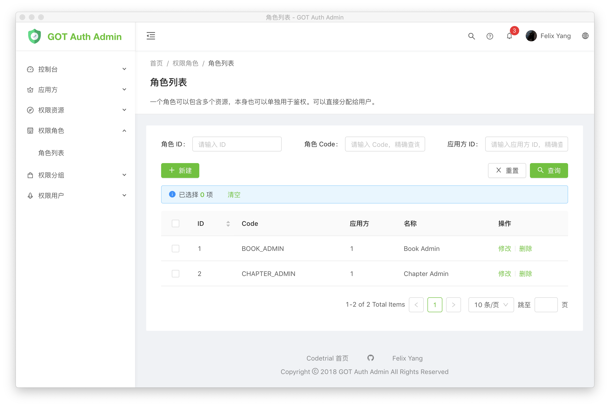

# GOT Auth Admin

专门为 [Got Auth Service](https://github.com/codetrial/got-auth-service) 打造的管理系统。

简体中文 | [English](./README.md)

## 文档

[:zap: 在线预览](https://got-auth-admin.netlify.com) | [:book: 参考文档](https://codetrial.github.io/gotauth)

## 截图

## 贡献

期待你的 `pull requests`。如果你觉得有帮助，还请多多反馈！

## 技术栈

- [GOT Auth Service](https://github.com/codetrial/got-auth-service)
- [Generator Antd Pro](https://github.com/codetrial/generator-antd-pro)
- [Ant Design Pro](https://github.com/ant-design/ant-design-pro)

## 许可

[MIT](http://opensource.org/licenses/MIT)

Copyright (c) 2018 - present, Felix Yang
